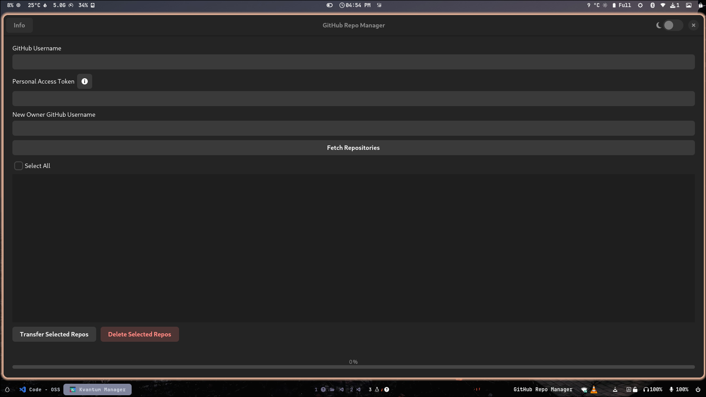
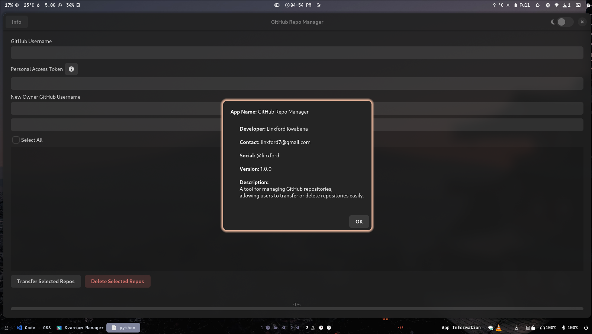
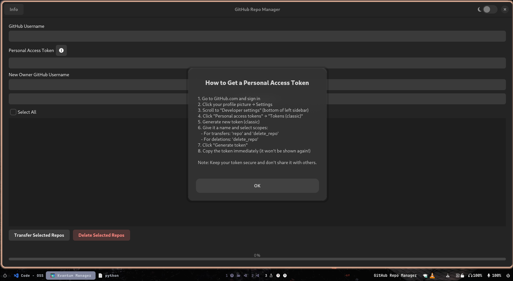
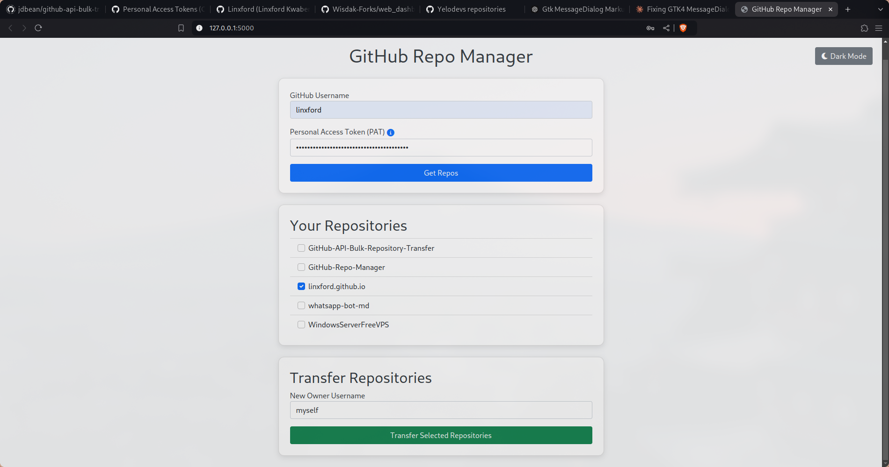

---

# GitHub Repo Manager

A tool for managing GitHub repositories, available in both a desktop (GTK-based) and web (Flask-based) version. It allows users to fetch, transfer, or delete their repositories with ease, leveraging the GitHub API.

## Table of Contents
- [About](#about)
- [Features](#features)
- [Screenshots](#screenshots)
- [Documentation](#documentation)
  - [Desktop Version](#desktop-version)
  - [Web Version](#web-version)
- [Installation](#installation)
  - [Desktop Version](#desktop-version-installation)
  - [Web Version](#web-version-installation)
- [Contributing](#contributing)
- [License](#license)

---

## About

**GitHub Repo Manager** is an open-source application available both as a desktop app and a web app. It is designed to simplify bulk repository management tasks on GitHub, such as transferring repositories to new owners or deleting repositories. The project uses the GitHub API to perform these operations.

---

## Features

- **Fetch Repositories**: Retrieve a list of all repositories associated with your GitHub account.
- **Transfer Ownership**: Transfer selected repositories to another GitHub user.
- **Delete Repositories**: Delete selected repositories from your account.
- **Cross-Platform**: Available as a GTK desktop app and a Flask web app.
- **Light/Dark Mode**: (Desktop version) Toggle between light and dark themes.

---

## Screenshots

### Desktop Version




### Web Version


---

## Documentation

### Desktop Version

The desktop version is built with Python and GTK 4 and provides a graphical user interface for managing repositories.

#### Features:
- **Personal Access Token**: Enter your GitHub PAT to authenticate.
- **Username**: Input your GitHub username to fetch repositories.
- **Transfer Repositories**: Select repositories to transfer ownership.
- **Delete Repositories**: Select repositories to delete from your account.

#### Setup:

1. **Personal Access Token Setup**:
   - Go to GitHub and generate a Personal Access Token with `repo` and `delete_repo` scopes.

2. **Installation**:
   See the [Installation](#desktop-version-installation) section below for instructions on setting up the desktop app.

3. **Running the Desktop App**:
   After installation, run the app using `python3 main.py`.

### Web Version

The web version provides the same functionality as the desktop app but is accessible via a web browser. It is built with Flask and allows users to manage their GitHub repositories through a web interface.

#### Features:
- **Fetch Repositories**: Enter your GitHub username and token to fetch repositories.
- **Transfer Repositories**: Transfer a repository to another GitHub user.
- **API-based Operations**: Transfer and delete repositories via GitHub API using POST requests.

#### API Endpoints:

- `/get_repos`: POST request to fetch repositories.
- `/transfer`: POST request to transfer a repository.

---

## Installation

### Desktop Version Installation

#### Prerequisites:
- Python 3.x
- GTK 4 and LibAdwaita (for GUI components)

#### Steps:
1. **Clone the repository**:
   ```bash
   git clone https://github.com/linxford/github-repo-manager.git
   cd github-repo-manager
   ```

2. **Install dependencies**:
   ```bash
   pip install requests PyGObject
   ```

3. **Run the desktop app**:
   ```bash
   python3 main.py
   ```

### Web Version Installation

#### Prerequisites:
- Python 3.x
- Flask (for the web framework)
- GitHub API Personal Access Token (PAT)

#### Steps:
1. **Clone the repository**:
   ```bash
   git clone https://github.com/linxford/github-repo-manager.git
   cd github-repo-manager
   ```

2. **Install dependencies**:
   ```bash
   pip install requests Flask
   ```

3. **Run the web app**:
   ```bash
   python3 app.py
   ```

4. **Access the app**:
   Open your web browser and go to `http://127.0.0.1:5000` to interact with the web-based version of the GitHub Repo Manager.

#### Deployment (Optional):
If you'd like to deploy the Flask app to a live server, you can use platforms like **Heroku** or **PythonAnywhere**. Follow the respective platform's guidelines for deploying Flask applications.

---

## Contributing

We welcome contributions from the community to help improve GitHub Repo Manager! Here's how you can get involved:

1. **Fork the Repository**: Click on "Fork" at the top right of this page.
2. **Clone Your Fork**: Clone the repository to your local machine.

   ```bash
   git clone https://github.com/linxford/github-repo-manager.git
   cd github-repo-manager
   ```

3. **Create a New Branch**: For any new feature or bug fix, create a new branch.

   ```bash
   git checkout -b feature/my-feature
   ```

4. **Make Your Changes**: Edit the files and implement your feature or fix.
5. **Commit and Push**: Once you've made your changes, commit them and push to your forked repository.

   ```bash
   git add .
   git commit -m "Added a new feature"
   git push origin feature/my-feature
   ```

6. **Submit a Pull Request**: Go to the original repository and open a Pull Request with a description of your changes.

### Guidelines

- **Code Style**: Follow Python's PEP8 guidelines.
- **Commit Messages**: Provide clear and descriptive commit messages.
- **Testing**: Ensure that your code works and doesn't break any existing features.
- **Documentation**: If you add new features, update the documentation accordingly.

---

## License

This project is licensed under the MIT License. See the [LICENSE](LICENSE) file for more details.

---
